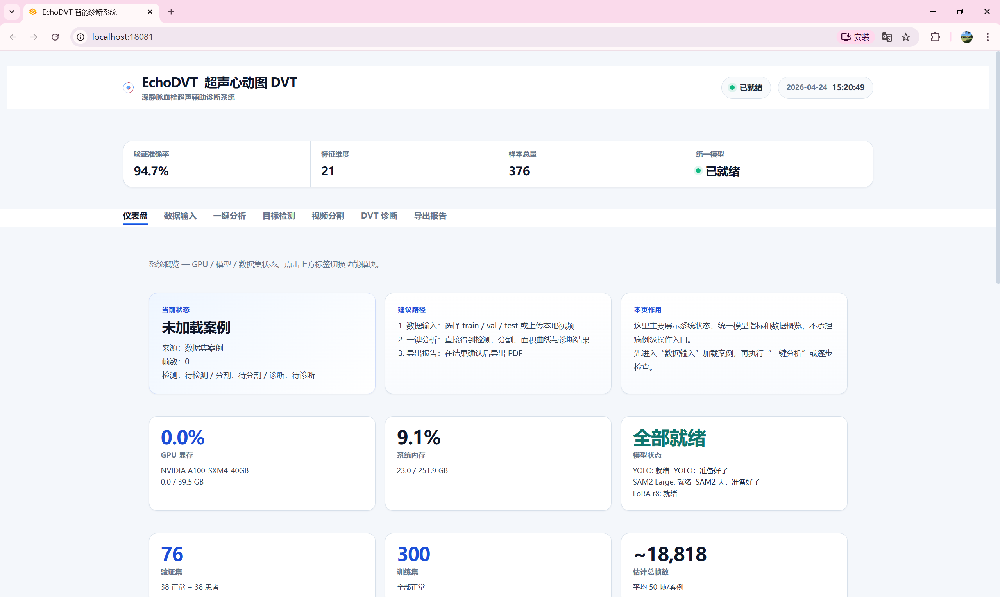
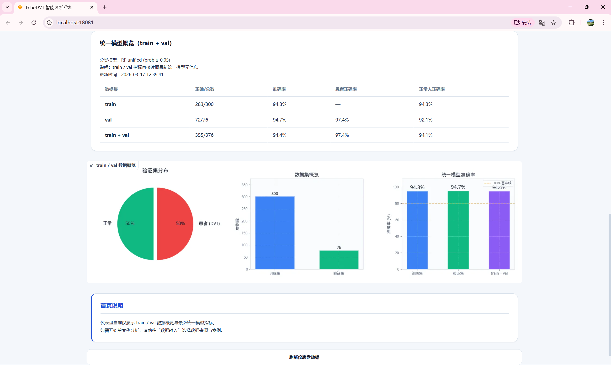
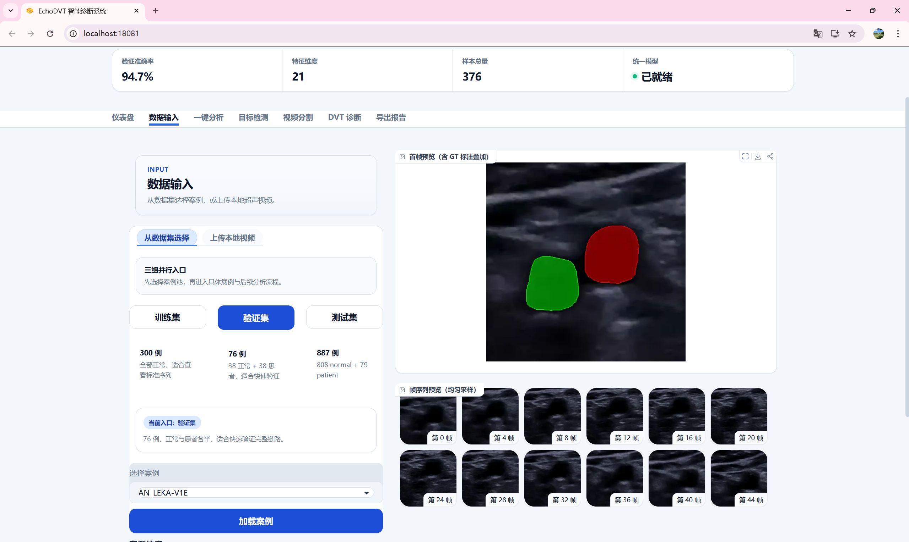
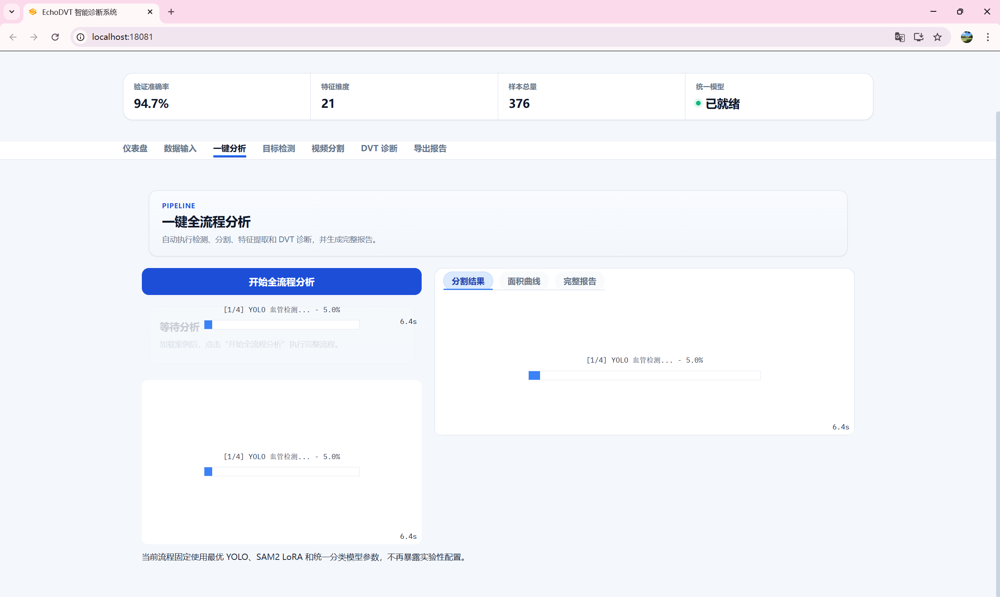
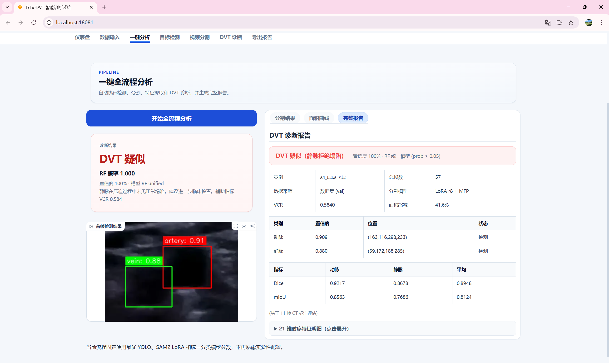
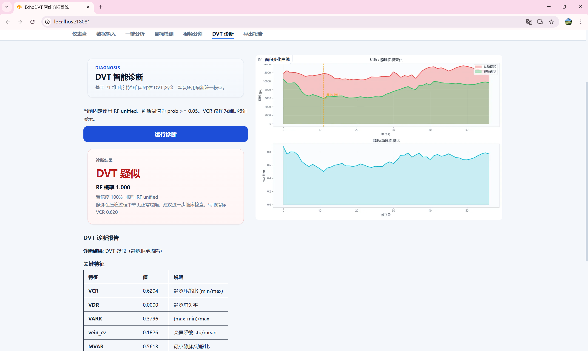
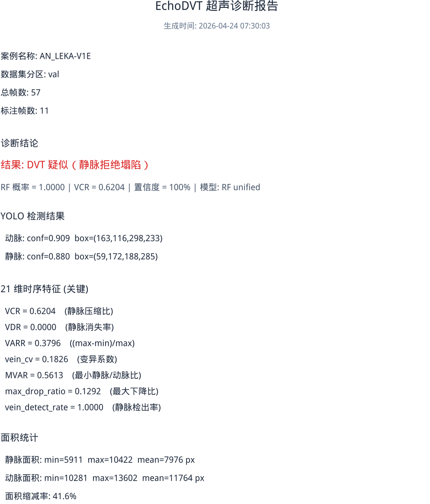

# EchoDVT

EchoDVT 是一个基于超声视频的深静脉血栓辅助诊断项目，主线流程为：
深静脉血栓（Deep Vein Thrombosis，DVT）是一种常见的血管疾病，其最严重的并发症肺栓塞可导致患者死亡。
加压超声检查是当前诊断DVT的首选影像学方法，但其诊断过程高度依赖操作者经验、单例检查耗时较长且不同医生之间的诊断一致性难以保证。
为解决这些问题，本文设计并实现了EchoDVT——一个基于超声视频的深静脉血栓自动检测系统。

```text
超声视频
→ YOLO 首帧血管检测
→ SAM2 + LoRA 视频分割
→ 21 维时序特征提取
→ RF unified 二分类
→ Web 可视化与 PDF 报告
```

项目当前的目标不是做通用实验平台，而是收敛成一条稳定、可复现、可展示的主线诊断链路。

## 项目特色与成果

EchoDVT 的特色不是单点模型，而是把“检测、分割、诊断、展示”做成一条完整闭环：

| 方向 | 项目特色 | 当前成果 |
|------|----------|----------|
| 首帧定位 | YOLO 检测 artery / vein，并用解剖位置先验补全漏检框 | `val` 首帧两类同时成功率 `85.5%`，train 两类同时成功率 `100.0%` |
| 视频分割 | SAM2 Large 负责传播，LoRA r8 做超声域适配，MFP 定期重新锚定 | LoRA r8 + MFP 的 frame-weighted Dice 为 `0.7853`，Vein Dice 为 `0.7166` |
| DVT 判断 | 从 mask 序列提取 21 维压缩时序特征，用 RF unified 输出概率 | `val_accuracy = 94.74%`，`val_recall = 97.37%` |
| 展示交付 | Web 串联数据输入、检测、分割、诊断和 PDF 报告 | 支持单病例一键分析、面积曲线、诊断摘要和报告导出 |

系统面向的核心演示问题是：输入一段压缩超声视频后，能否自动定位血管、跟踪动静脉面积变化，并把“静脉能否被压瘪”转化成可解释的 DVT 风险判断。

## 系统界面与演示流程

基于 Gradio 构建的 Web 系统将整条主线（首帧检测、视频分割、特征提取、DVT 诊断）串联成了直观、可交互的辅助诊断平台。以下是系统的核心模块展示：

### 1. 仪表盘与模型概览
进入系统后，首先展示系统当前状态，包括 GPU 显存监控、核心模型（YOLO, SAM2, LoRA）的就绪状态，以及模型性能指标（验证准确率 94.7%）。系统还提供了各数据集（train/val）上的分布和正确率统计，方便快速确认系统可信度。



### 2. 数据输入
支持从已有数据集（训练集、验证集、测试集）中快速加载病例，或通过拖拽上传本地超声视频。加载后即可进行首帧及帧序列的预览。


### 3. 一键全流程分析
系统提供一键分析功能，自动依次执行首帧检测、序列分割、特征计算到结论输出的完整管线，伴有清晰的进度条展示。


### 4. 目标检测首帧结果
直观展示 YOLO 对首帧的处理结果，明确标识出动脉 (Artery) 和静脉 (Vein) 的边界框及其置信度，并给出是否触发了解剖位置先验补全。


### 5. DVT 智能诊断
系统基于 21 维时序特征给出最终的 DVT 概率和风险提示（例如：“DVT 疑似 (静脉拒绝塌陷)”）。页面同时提供动脉/静脉面积变化曲线（VCR 等关键特征）和全部 21 维特征明细表，辅助医生判断。


### 6. 报告导出
支持将当前病例的各阶段关键数据打包，一键生成包含基本信息、检测指标、面积统计和诊断结论的结构化超声诊断 PDF 报告，便于留档或打印。


## 功能总览

| 功能 | 入口 | 输出 |
|------|------|------|
| 浏览已有病例 | Web 数据输入页 | 首帧预览、帧列表、case 信息 |
| 上传本地视频 | Web 数据输入页 | 抽帧后的临时 case，可继续检测和诊断 |
| 首帧血管检测 | Web 目标检测页 / `yolo/inference.py` | artery / vein 框、置信度、补全标记 |
| 视频分割 | Web 视频分割页 / `sam2/inference_lora.py` | 每帧 semantic mask、动脉面积、静脉面积、Dice/mIoU |
| 一键诊断 | Web 一键分析页 / `classify_dvt.py` | DVT 概率、阈值、结论、21 维特征 |
| 报告导出 | Web 导出报告页 | PDF 病例报告 |

## 当前默认配置

当前离线评估与 Web 主线统一使用以下配置：

| 模块 | 当前默认配置 |
|------|--------------|
| YOLO | `yolo/runs/detect/runs/detect/dvt_runs/aug_step5_speckle_translate_scale/weights/best.pt` |
| YOLO 阈值 | `conf = 0.1` |
| SAM2 主干 | `sam2_hiera_large.pt` |
| SAM2 微调 | `LoRA r8` |
| 多帧提示 | `MFP`，间隔 `15` 帧，最低置信度 `0.3`，最多 `5` 个额外 prompt |
| 分类器 | `RF unified` |
| 分类阈值 | `prob >= 0.05` |
| 特征维度 | `21` |

统一模型元信息位于：

```text
artifacts/unified_model/rf_unified.json
```

当前记录的关键指标为：
- `train_accuracy = 94.33%`
- `val_accuracy = 94.74%`
- `val_recall = 97.37%`
- `val_precision = 92.50%`

## 目录结构

```text
EchoDVT/
├── README.md
├── classify_dvt.py
├── artifacts/
│   ├── figures/
│   ├── tables/
│   ├── scripts/
│   ├── e2e_classify_v3/
│   └── unified_model/
├── web/
│   ├── app.py
│   ├── services/
│   ├── tabs/
│   ├── utils/
│   └── assets/
├── yolo/
│   ├── inference.py
│   ├── compute_prior_stats.py
│   ├── train_*.py
│   ├── prior_stats.json
│   └── README.md
└── sam2/
    ├── inference_box_prompt_large.py
    ├── inference_lora.py
    ├── train_lora.py
    ├── checkpoints/
    ├── sam2/
    ├── README_EchoDVT.md
    └── README.md
```

## 数据

### 标注分割数据

当前主线使用的分割数据位于：

```text
sam2/dataset/
├── train/   # 300 例，全部正常
└── val/     # 76 例，38 正常 + 38 患者
```

每个 case 通常包含：
- `images/`
- `masks/`

其中 mask 的语义约定为：
- `0 = 背景`
- `1 = 动脉`
- `2 = 静脉`

### Web 可浏览测试集

Web 的数据输入页还支持浏览：

```text
test/
├── normal/
└── patient/
```

这部分主要用于病例浏览和推理，不等同于带稀疏标注的 train / val 分割集。

## 各模块职责

### 1. `yolo/`

负责首帧动脉/静脉检测，并在漏检时利用位置先验补全缺失框。

重点：
- 渐进式增强训练
- Speckle 噪声增强
- 先验补全与重叠修正

详见 [yolo/README.md](yolo/README.md)。

### 2. `sam2/`

负责视频分割与训练。

当前主线是：
- SAM2 Large
- LoRA 微调
- 多帧提示 MFP

当前 Web 和离线默认命令不启用 RPA、OKM、DAM。`sam2/inference_lora.py` 仍保留 `--rpa`、`--okm`、`--dam` 等实验开关，默认关闭；旧版 adaptive-memory / AM-SM-AV 支线已经移除，不属于当前支持实现。

详见：
- [sam2/README_EchoDVT.md](sam2/README_EchoDVT.md)
- [sam2/README.md](sam2/README.md)

### 3. `classify_dvt.py`

负责从语义 mask 序列中提取 21 维时序特征，并使用统一 RF 分类器完成 DVT 判断。

输出核心包括：
- `probability`
- `threshold`
- `is_dvt`
- `vcr`
- 全量特征字典

### 4. `web/`

负责将整条主线串成可交互界面。

当前 Web 设计原则：
- 固定最优权重
- 固定稳定参数
- 支持单案例完整分析
- 不对外暴露实验性变体切换

详见 [web/README.md](web/README.md)。

## Web 快速启动

```bash
conda activate echodvt
cd /data1/ouyangxinglong/EchoDVT/web
python app.py --server-name 0.0.0.0 --port 18081
```

浏览器访问：

```text
http://<server-ip>:18081
```

如果通过 SSH 使用，建议本地转发：

```bash
ssh -N -L 7860:127.0.0.1:18081 <user>@<server>
```

推荐演示路线：

```text
数据输入选择一个 val/test case
→ 一键分析
→ 查看首帧检测框、分割采样图、面积曲线和诊断摘要
→ 导出 PDF 报告
```

如果要展示算法细节，可以按 Tab 拆开演示：

```text
目标检测 → 视频分割 → DVT 诊断 → 导出报告
```

## 常用命令

### YOLO 检测推理

```bash
cd yolo
python inference.py
```

`yolo/inference.py` 当前通过脚本顶部常量配置权重、数据集、阈值和输出目录；默认会在 `yolo/predictions/aug_step5_speckle_translate_scale/` 下生成带时间戳的评估结果。

### SAM2 LoRA 推理

```bash
cd sam2
python inference_lora.py \
  --lora-weights checkpoints/lora_runs/lora_r8_lr0.0003_e25_20260314_153210/lora_best.pt \
  --lora-r 8 \
  --split val \
  --multi-frame-prompt True
```

### DVT 离线分类

```bash
python classify_dvt.py --split val
```

常见输出包括：

| 文件 | 含义 |
|------|------|
| `features.csv` | 每个病例的 21 维时序特征 |
| `classification_report.json` | 分类指标、阈值、模型表现摘要 |
| `per_case_results.csv` | 每个病例的真实标签、预测概率和是否正确 |
| `masks/` | 端到端模式下缓存的逐帧预测 mask |

## 环境

推荐直接使用项目环境：

```bash
conda activate echodvt
```

核心依赖包括：
- `torch`
- `torchvision`
- `ultralytics`
- `gradio >= 6.0`
- `opencv-python`
- `matplotlib`
- `scikit-learn`
- `pandas`
- `scipy`

## 文档分工

为了减少重复维护，当前文档分工如下：
- 本文件：项目总览、主线配置、目录与入口
- [web/README.md](web/README.md)：当前 Web 结构、状态流和使用方式
- [yolo/README.md](yolo/README.md)：YOLO 训练与检测设计
- [sam2/README_EchoDVT.md](sam2/README_EchoDVT.md)：SAM2 定制点与分割主线

如果代码与 README 不一致，应优先以当前代码实现为准，再回补文档。
